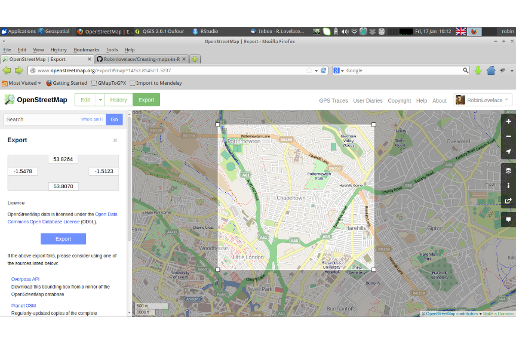
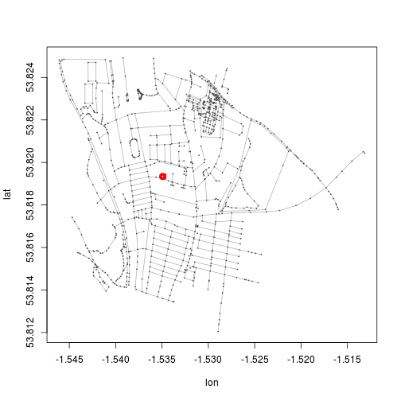
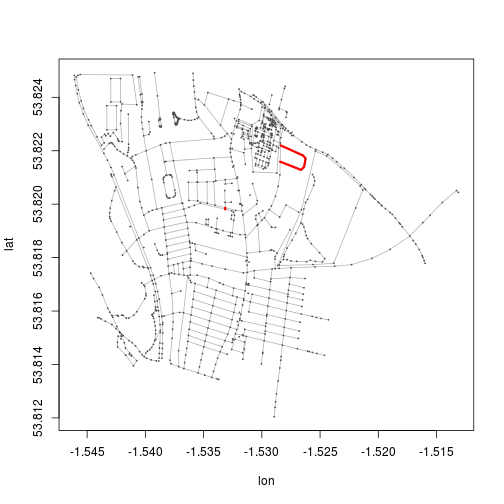
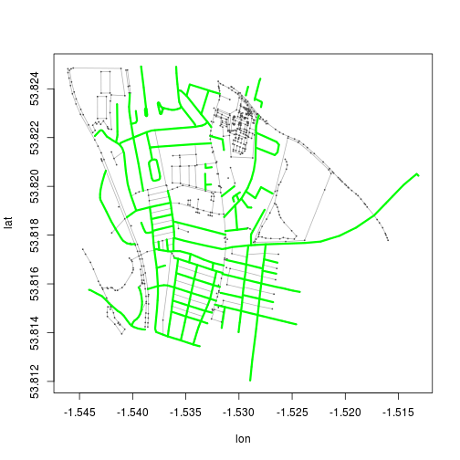
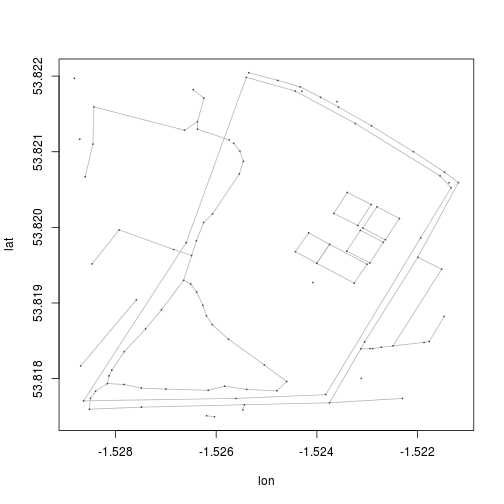

Open Street Map: loading, analysing and visualising free maps with R and QGIS
========================================================

This tutorial shows how open source tools can be used to 
harness a huge and rapidly growing open source geodatabase: Open Street Map.
It is targeted at people new to Open Street Map, but who 
already have an understanding of basic GIS concepts.
Previous experience with the programs QGIS and R would be beneficial, 
but not essential, for completing the excercises. There are 
also a number of resources available on-line for more advanced functions, 
as described below.

# Introduction

Open Street Map (OSM) is a crowd-sourced map of the world, 
the archetype of 'volunteered geographical information'
([Goodchild 2007](http://www.ncgia.ucsb.edu/projects/vgi/docs/position/Goodchild_VGI2007.pdf)).
The aim is simple: "to create a set of map data that’s free
to use, editable, and licensed under new
copyright schemes", as described in an excellent review 
article on the subject 
([Haklay and Weber 2008](http://discovery.ucl.ac.uk/13849/1/13849.pdf))
Putting the public in charge of 
editing the world's surface may seem like a risky 
business, given that cartographers have specialist skills 
developed over centuries (as described in 
[Mapping the Void](https://dl.dropboxusercontent.com/u/15008199/egs2stay/Mapping_the_Void_-_Mapping_the_Void_b03s6mf0_default.m4a) an excellent BBC Radio 4 Documentary
on the subject (Salisbury and Jenkins 2014). 
Yet the emergence 
of high resolution aerial photography covering the entirety 
of the Earth's surface and the 
explosion in GPS ownership via smartphones has enabled citizens 
to become accurate sensors of the world. 
[Neis et al. (2012)](http://www.mdpi.com/1999-5903/4/1/1/pdf)
believe this phenomenon is more than merely technological.
In OSM, they see a "revolutionary paradigm shift on how map data is 
being collected".

with the added advantage that they are likely to know their local 
areas far better than any cartographer. 

## Why (and why not) use OSM data?

Of course there are teething issues with any large-scale open source 
database, including variable data quality, 
patchy and incomplete coverage and inconsistencies from place to place (Haklay 2010). Yet all of these
issues are gradually being out. The advantages of Open Street Map outweight these downsides for
many applications *already*. These include:

- Rapid updates of new projects
- Greater range of attributes (e.g. shop names)
- Ability to share data with anyone without breaching license

In additions there are a number of ethical benefits of using OSM: it's community
a map for the greater good ([Wroclawski 2014](http://www.theguardian.com/technology/2014/jan/14/why-the-world-needs-openstreetmap)). 

There is a strong community of OSM volunteers who use the service for humanitarian purposes
(Salisbury and Jenkins 2014).
Two excellent examples of this help underline the
ethical side of OSM data. [Tindale](http://explore.ramanitanzania.org/), 
a settlement in Tanzania that has been mapped rapidly 
thanks to a single academic project, in collaboration with the authorities, enabling 
better policy making in the area (see [video](http://www.youtube.com/watch?v=KqrGyvNnWkA)). 
Second, 
the rapid response of the OSM community to the Typhoon Haiyan disaster. In a matter of days, an 
army of volunteers had helped to map out the affected zone, aiding relief efforts (e.g. see
[MapBox's blog posts on the subject](https://www.mapbox.com/blog/typhoon-haiyan-openstreetmap/)).

## An overview of the tutorial

All of the code and data used to create this tutorial is available 
on [GitHub](http://github.com). Feel free to download the project as a `.zip` file from the 
[project's repository](https://github.com/Robinlovelace/osm-tutorial) entitled osm-tutorial and, 
if you would like to modify or improve it 
in any way, please fork a version for you own use, crediting the original where appropriate.

In this tutorial we focus simply on the technical challenge of extracting the 
data from servers 'in the cloud' and onto your desktop. We also cover some basic 
tasks in handling, subsetting and visualising the data, first in the 
graphical user interface (GUI) of QGIS, and then in the command line with R.
The next stage talks about editing raw OSM data, essential if you 
would like to take subsets of very large OSM datasets, such as `planet.osm` 
which takes up more than 30 GB of memory. The next stage is 
to talk about OSM data in PostGIS, a geodatabase program ideal 
for querying very large spatial datasets. Finally, there is a brief 
section on further resources. None of the sections require any of the 
previous ones although the level of difficulty generally increases 
as you progress. 

# Getting the data

OSM data of a specific area
can be downloaded directly from the [main map page](http://www.openstreetmap.org), from the 
[Overpass API](http://overpass-api.de/) or, for the entire planet, from the huge (currently 32 GB)
[planet.osm file](http://planet.openstreetmap.org/). A number of third parties also provide more manageable
chunks of this dataset, such as the single country datasets provided by
[GEOFABIK](http://download.geofabrik.de/). Command line programs 
[Osmosis](http://wiki.openstreetmap.org/wiki/Osmosis) and 
[Osm2pgsl](http://wiki.openstreetmap.org/wiki/Osm2pgsql) can be used to process raw OSM data 
in either `.osm` or `.osm.pbf` file formats. The former is essentially a `.xml` (Extensible Markup Language)
text file (encoded with the popular UTF-8 characterset); the latter is a compressed version of the former.
How we transfer these datasets into a useful form depends on the program you are using. 
In this tutorial we will explain how to do it in QGIS and R, as well describing the basics of 
getting it into a [PostGIS](http://postgis.net/) database.

# OSM data in QGIS

A `.osm` file can be downloaded from the openstreetmap.org with the bounding box selected by
default depending on the current view, or via a manual selection, as shown below.

 


To load this file into QGIS, you can simply use the `Add Vector Layer` button on the 
left of the screen. However this does not generate satisfactory results. 
The *recommended* way to import the data is via the the OSM plugin. When this is 
installed in QGIS 2.0, use the menus `Vector > OpenStreetMap` to import the xml file
and convert it into a SpatiaLite database. Then you can import it into the QGIS workspace. 


After this step the file has been saved as a `.osm.db` file. Use the 
`Export Topology to SpatiaLite` element of the same menu to 
load the file. Choose the type of spatial data you would like to load - 
Points, Lines or Polygons. At this stage one can also select which variables 
("Tags") you would like to add to the attribute data.


The data is now loaded into QGIS allowing standard methods of analysis. 
You will notice that the data are not styled at all, leading to very bland 
maps. To counter this, there have been custom styles developed for visualising OSM data in QGIS, 
e.g. [those by Anita Grazer](http://anitagraser.com/2012/02/25/light-styles-for-osm-layers-in-qgis/). 
Unfortunately these files do not seem to be working with the current version of QGIS so 
alternative ready-made styles must be created, as suggested by a 
[stackexchange question](http://gis.stackexchange.com/questions/42645/is-there-up-to-date-osm-sld-file-for-geoserver). 

Once the data is loaded into QGIS, it can be used as with any other spatial data.
Next, let's see how R can handle OSM data, via the `osmar` package.

# Using osmar 

`osmar` is an R package for downloading and interrogating OSM data that accesses 
the data directly from the internet via the R command line.
There is an excellent
[online tutorial](http://journal.r-project.org/archive/2013-1/eugster-schlesinger.pdf)
which provides a detailed account of the package (Eugster & Schlesinger, 2012). 
Here we will focus on loading some basic data on bicycle paths in Leeds.
First the package must be loaded:


```r
library(osmar)  # if the package is not already installed, use install.packages('osmar')
```

```
## Loading required package: XML
## Loading required package: RCurl
## Loading required package: bitops
## Loading required package: geosphere
## Loading required package: sp
## 
## Attaching package: 'osmar'
## 
## The following object is masked from 'package:utils':
## 
##     find
```


To download data directly, one first sets the source and a bounding box, 
and then use the `get_osm` function to download it. Selecting Chapeltown as the 
centrepoint of the map, we can download all the data in the square km surrounding it.


```r
src <- osmsource_api()
bb <- center_bbox(-1.53492, 53.81934, 1000, 1000)
ctown <- get_osm(bb, source = src)
plot(ctown)
points(-1.53492, 53.81934, col = "red", lwd = 5)
```

 


This shows that the data has successfully been loaded and saved as an 
object called `ctown`. Let's try analysing this object further. 
In fact, `ctown` is technically a list, composed of 3 objects:
nodes (points), ways (lines) and relations (polygons composed of 
many lines). Such OSM data is thus provided a class of its own, 
and each sub-object can be called separately using the `$` symbol:


```r
names(ctown)
```

```
## [1] "nodes"     "ways"      "relations"
```

```r
class(ctown)
```

```
## [1] "osmar" "list"
```

```r
summary(ctown$ways)
```

```
## osmar$ways object
## 179 ways, 505 tags, 1270 refs 
## 
## ..$attrs data.frame: 
##     id, visible, timestamp, version, changeset, user, uid 
## ..$tags data.frame: 
##     id, k, v 
## ..$refs data.frame: 
##     id, ref 
##  
## Key-Value contingency table:
##            Key               Value Freq
## 1      highway         residential   71
## 2  source:name OS_OpenData_Locator   49
## 3      highway             service   41
## 4   created_by                JOSM   25
## 5       source                Bing   23
## 6      highway        unclassified   17
## 7      highway             footway   15
## 8     building                 yes   11
## 9          lit                 yes   11
## 10      source                 npe   10
```


Let's use the dataset we have loaded to investigate the cycle 
paths in the vicinity of my house. First we need to understand the data
contained in the object. Let's look at the tags and the attributes of the `ways` object:


```r
summary(ctown$ways$tags)  # summary of the tag data
```

```
##        id                     k                         v      
##  Min.   :5.09e+06   highway    :155   residential        : 71  
##  1st Qu.:7.73e+06   name       :128   OS_OpenData_Locator: 49  
##  Median :8.46e+07   source     : 56   service            : 41  
##  Mean   :8.71e+07   source:name: 54   yes                : 32  
##  3rd Qu.:1.50e+08   created_by : 25   JOSM               : 25  
##  Max.   :2.45e+08   building   : 12   Bing               : 23  
##                     (Other)    : 75   (Other)            :264
```

```r
head(ctown$ways$attrs, 8)  # attributes of first 8 ways - see I'm in there!
```

```
##         id visible           timestamp version changeset            user
## 1  5088536    true 2013-02-22 22:08:24      13  15128484 CompactDstrxion
## 2 22818969    true 2012-09-08 23:06:53      20  13039300    LeedsTracker
## 3  6273628    true 2007-09-21 17:25:37       1    483846          SteveC
## 4  6273619    true 2012-12-01 17:57:45       2  14114856            sc71
## 5  6273721    true 2007-09-16 17:23:14       1    444107            noii
## 6  6273722    true 2007-09-16 17:23:16       1    444107            noii
## 7  6273726    true 2007-09-16 17:23:20       1    444107            noii
## 8  6273736    true 2013-11-02 10:56:24       5  18672988   RobinLovelace
##      uid
## 1 464727
## 2   2330
## 3    682
## 4 106831
## 5  13550
## 6  13550
## 7  13550
## 8 231314
```


From looking at the [OSM tagging system](http://wiki.openstreetmap.org/wiki/Tags), we can deduce that 
`id` is the element's id,
`k` refers to the OSM key (the variables for which the element 
has values) and that `v` is the value assigned for each 
id - key combination. Because OSM data is not a simple data frame, 
we cannot use the usual R notation for subsetting. Instead we use the 
`find` function. Let us take a subset of bicycle paths in the area
and plot them.


```r
bikePaths <- find(ctown, way(tags(k == "bicycle" & v == "yes")))
bikePaths <- find_down(ctown, way(bikePaths))
bikePaths <- subset(ctown, ids = bikePaths)
plot(ctown)
plot_ways(bikePaths, add = T, col = "red", lwd = 3)
```

 


The above code block is used to identify all ways in which cycling 
is permitted, "overriding default access", according OSM's excellent 
[wiki page on bicycle paths](http://wiki.openstreetmap.org/wiki/Bicycle).

According to this source, the correct way to refer to an on-road cycle path 
is with the `cycleway` tag. However, none of these have been added to the
roads that have on-road cycle lanes in this example dataset (as of January 2014).
Perhaps someone will add these soon. 


```r
which(ctown$ways$tags$k == "cycleway")
```

```
## integer(0)
```


There are, by contrast, a large number of ways classified as "residential".
Let us use the same method to select them and add them to the map.


```r
res <- find(ctown, way(tags(k == "highway" & v == "residential")))
res <- find_down(ctown, way(res))
res <- subset(ctown, ids = res)
plot(ctown)
plot_ways(res, add = T, col = "green", lwd = 3)
```

 


# Handling raw OSM data

Although this section will be of most use for dealing with 
very large files, a small example is used here to showcase the methods
The file `map.osm` downloaded directly from [openstreetmap.org](http://www.openstreetmap.org)
is small, allowing available on-line, from 
[here](https://github.com/Robinlovelace/osm-tutorial/blob/master/data/map.osm?raw=true) 
(highlighting the advantages 
of open data for educational purposes - there are few license restrictions).

The Java command line tool [Osmosis](http://wiki.openstreetmap.org/wiki/Osmosis)
is used for this purpose.

To show how Osmosis can subset raw OSM files, let us take a real world example from 
the dataset we imported with the `osmar` package. Imagine that we want to extract all 
osm data (nodes, ways and relations) from the area in and around Potternewton Park.
We could do this manually by looking up the park on-line and selecting the associated
elements in QGIS. But imagine we want to do it from the 
command line (e.g. for batch processing).
First we need a bounding box of all items containing the 
text string "Potternewton Park". For this we use `osmar`:


```r
potter <- find(ctown, way(tags(grepl("Potternewton Park", ctown$ways$tags$v))))
potter <- find_down(ctown, way(potter))
potter <- subset(ctown, ids = potter)
plot_ways(potter)  # sanity check
```

 

```r
potter.l <- as_sp(potter, "lines")  # convert data to sp class
b <- bbox(potter.l)  # save the bounding box
b[1, ] <- (b[1, ] - mean(b[1, ])) * 1.05 + mean(b[1, ])
b[2, ] <- (b[2, ] - mean(b[2, ])) * 1.05 + mean(b[2, ])
# scale longitude and latitude (increase bb by 5% for plot) replace 1.05
# with 1.xx for an xx% increase in the plot size
b
```

```
##      min    max
## x -1.529 -1.521
## y 53.817 53.822
```


Now that we know the bounding box, we can transfer to using osmosis from 
the command line. If the shell is open in the correct working directory
(e.g. "osm-tutorial-master", if downloaded from GitHub), the following 
code will subset the data and output a new, smaller `.osm` file.

```
osmosis --read-xml data/map.osm --bounding-box top=53.822093 left=-1.528815 bottom=53.817486 right=-1.521155 --write-xml potter.osm

```

To check whether or not this has worked, and demonstrate `osmar`'s ability to read in 
`.osm` files, let us try to load an plot the dataset just exported by osmosis.


```r
src <- osmsource_osmosis(file = "data/potter.osm")
bp <- center_bbox(mean(b[1, ]), mean(b[2, ]), 1000, 1000)
potter <- get_osm(bp, src)
plot(potter)
```

 


Local knowledge or a quick look on an online will confirm that this is 
indeed Potternewton Park, with is rectangular tennis courts, play area 
and skate park just west of its centre. The file `potter.osm` can 
equally be loaded into QGIS or any other GIS. The point is to illustrate
how Osmosis works. 

For further functionality, including clipping to polygons, extracting files from 
enormous and compressed `planet.osm.bz2` files and ways to extract only elements with 
certain attributes, please refer to the 
[osmosis page of the osm wiki](http://wiki.openstreetmap.org/wiki/Osmosis). 
The final section discusses (but does not implement)
the most advanced method of harnessing OSM data, via a PostGIS database. 

# Creating a PostGIS database of OSM data

There are a number of advantages of storing large datasets 
in a database:

- The data can be accessed by a variety of 3rd party programs
- Spatial queries can be made by a variety of clients accessing the db, widening the funcionallity
- Huge datasets can be stored in a database, as it sits on the hard disk, only being 
transfered to RAM when a specific query is called

Because of the size and complexity of the planet-wide OSM database, it must 
be stored in an spatial database to be used. For this use the command line tool 
[osm2pgsql](http://wiki.openstreetmap.org/wiki/Osm2pgsql). The basics of installation 
and usage can be found online. 

Using a spatial database, it does not take a very large leap to realise that 
organisations can create a customised version of the OSM database for their own purposes.
For example, an organisation interested in store location analysis could keep maintained 
a version of OSM with everything with elements labelled as shops removed. Alternatively, 
an organisation interested in woodlands could maintain an up-to-date version 
of OSM woodlands. Both organisations could supplement these custom databases with their
own data, combining the best of crowd-sourced and centralised data collection methods.

The [OSM-GB](http://wiki.openstreetmap.org/wiki/Osm2pgsql) project, hosted at the University
of Nottingham does precisely this, with the aim of quality-checking community contributed data.
Here is not the place to describe how to set-up a PostGIS database with OSM data, but is well 
worth flagging as it has great potential, especially when combined with rapidly 
evolving open source web mapping technologies such as 
[GeoServer](http://geoserver.org/display/GEOS/Welcome)
(part of the 
[GeoNode](http://geonode.org/) stack), [Leaflet](http://leafletjs.com/) and 
[GeoDjango](https://www.djangoproject.com/). 

With the certainty of peak oil and possibility of 
effective climate change regulations, trasport will become increasing 
expensive in future years. Thus, the tendency towards geographical 
homogenisation of economic activity may go into reverse 
([Greer 2009](http://books.google.co.uk/books?hl=en&lr=&id=mkV_knlze0QC&oi=fnd&pg=PP2&dq=ecotechnic+future&ots=nATRuCVL31&sig=bwafIZ7kfmZMK1EscQcKyIGeYsU&redir_esc=y#v=onepage&q=ecotechnic%20future&f=false); 
[Curtis  2009](http://www.sciencedirect.com/science/article/pii/S0921800909003334)). 
This is bad news for many, but it is good news for people with 
a strong interest in regional diversity, local economies and geographic diversity. 

It is also potentially good news for geographers advocating for location-specific 
solutions. With increased concern over the 
highly centralised power structures of the internet following the 
revelations leaked by Edward Snowdon about massive online spying 
and infringement of digital privacy, there 
is a huge potential for community-based, problem-specific solutions.
It is with this wider context in mind that this tutorial ends - 
think of the potential benefits if citizens were encouraged to be
both producers and consumers of the maps on which we all now depend.
Happy mapping!

# Further on-line resources

There is already some good on-line material about OSM data, including:

- a [paper](http://www.mdpi.com/1999-5903/5/2/282/pdf) comparing the quality and 
coverage of OSM map data in different parts of the world
- an [overview](http://www.library.carleton.ca/sites/default/files/help/gis/WorkingWithOpenStreetMap.pdf)
of handling OSM data in ArcMap
- a [tutorial](http://elogeo.nottingham.ac.uk/xmlui/bitstream/handle/url/289/osm-tutorial-final-2.pdf?sequence=1) illustrating 
its potential use for GIS education and store location planning

# References 

Curtis, F. (2009). Peak globalization: Climate change, oil depletion and global trade. Ecological Economics, 69(2), 427-434.

Eugster, M. J., & Schlesinger, T. (2013). osmar: OpenStreetMap and R. The R Journal, 5(1), 53-63.

Goodchild, M. F. (2007). Citizens as sensors: the world of volunteered
geography. GeoJournal, 69(4), 211–221.

Greer, J. M. (2009). The Ecotechnic Future: Envisioning a post-peak world. New Society Publishers.

Haklay, M., & Weber, P. (2008). Openstreetmap: User-generated street maps. Pervasive Computing, IEEE, 7(4), 12-18.

Neis, P., Zielstra, D., & Zipf, A. (2011). The street network evolution of crowdsourced maps: OpenStreetMap in Germany 2007–2011. Future Internet, 4(1), 1-21.

Salisbury, C. & Jenkins, J. (2014). Mapping the Void.  Broadcast on BBC Radio 4, 11:00AM Mon, 27 Jan 2014. Available on I-Player until 11:32AM Mon, 3 Feb 2014. Available on my 
[Dropbox account](https://dl.dropboxusercontent.com/u/15008199/egs2stay/Mapping_the_Void_-_Mapping_the_Void_b03s6mf0_default.m4a) for forseable future.

Wroclawski, S. (2014). Why the world needs OpenStreetMap. The Guardian. Tuesday 14 January 2014 11.52 GMT.


```r
source("md2pdf.R")  # convert knitr document to LaTeX
```


